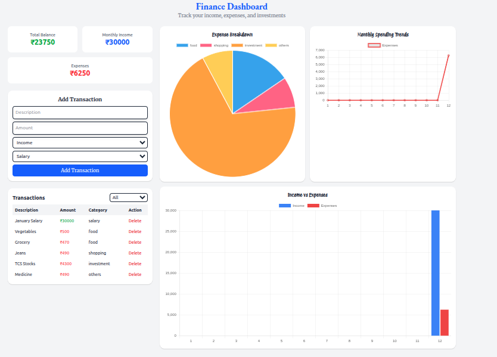
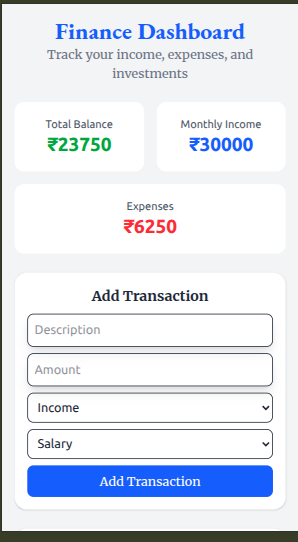
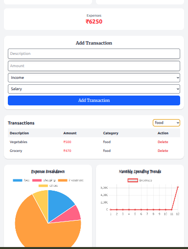

# 💰 Personal Finance Dashboard

A responsive **Personal Finance Dashboard** web application that allows users to track their **income, expenses, and investments** in real time.  
Built using **HTML5**, **Tailwind CSS**, **JavaScript**, and **Chart.js**.

---

## 🚀 Features

### 🧮 Dashboard Summary
- Displays **Total Balance**, **Monthly Income**, and **Monthly Expenses**
- Real-time balance updates when transactions are added or deleted
- Animated counter for smooth visual feedback

### 💵 Transaction Management
- Add new transactions with:
  - Description
  - Amount
  - Type (Income / Expense)
  - Category
- Delete existing transactions
- Filter transactions by category

### 📊 Data Visualization (Chart.js)
- **Pie Chart** – Expense breakdown by category  
- **Line Chart** – Monthly spending trends  
- **Bar Chart** – Income vs Expense comparison  

### 💾 Data Persistence
- Transactions are saved in **LocalStorage**
- Data remains available even after browser refresh

### 📱 Responsive Design
- **Mobile-first** layout using Tailwind CSS grid and flex utilities  
- Optimized for all screen sizes  
- Touch-friendly buttons (minimum 44px height)  

---

## 🧠 Tech Stack

| Technology | Purpose |
|-------------|----------|
| **HTML5** | Semantic structure & accessibility |
| **Tailwind CSS** | Responsive and modern UI styling |
| **JavaScript (ES6)** | App logic and DOM manipulation |
| **Chart.js** | Interactive data visualization |
| **LocalStorage API** | Data persistence |

---
🗂️ Project Structure
finance-dashboard-frontend/
├── src  
    ├── index.html        # Main HTML file
    ├── styles.css        # Custom theme variables and minor overrides
    ├── script.js         # Application logic and Chart.js integration
|── README.md         # Project documentation


## ⚙️ Setup Instructions

1. **Clone this repository**
   ```bash
   git clone https://github.com/Majid0899/finance-dashboard-frontend.git
   cd finance-dashboard-frontend

2. **Run this application
    open index.html in browser


## Screenshots




🧑‍💻 Author

Majid Khan
📧 majidkhan0899@gmail.com

🌐 GitHub Profile
https://github.com/Majid0899
